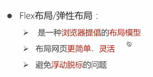
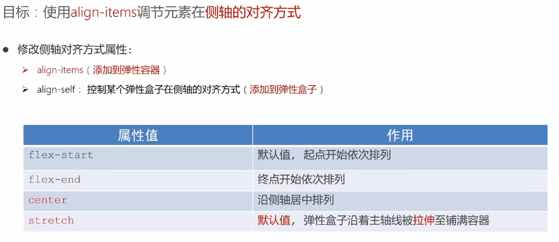

# 移动端

## 布局

### 1. Flex布局

> **flex布局**<br>
> 

> **align-items**
> 

```css
/*
弹性布局/flex布局，###pc端有兼容性，但是移动端没有兼容性###
父元素使用，可以让子元素间隔排序，省去margin：auto
*/

.box {
    display: flex;
    /*  间距在弹性盒子（子级）之间  */
    justify-content: space-between;
    /*  所有地方的间距都相等  */
    justify-content: space-evenly;
    /*  每个子级都有左右margin且相等  */
    justify-content: space-around;
    /*  子级居中  */
    align-items: center;
    /*  子级拉伸至父级高度，默认存在  */
    align-items: stretch;
}
```

