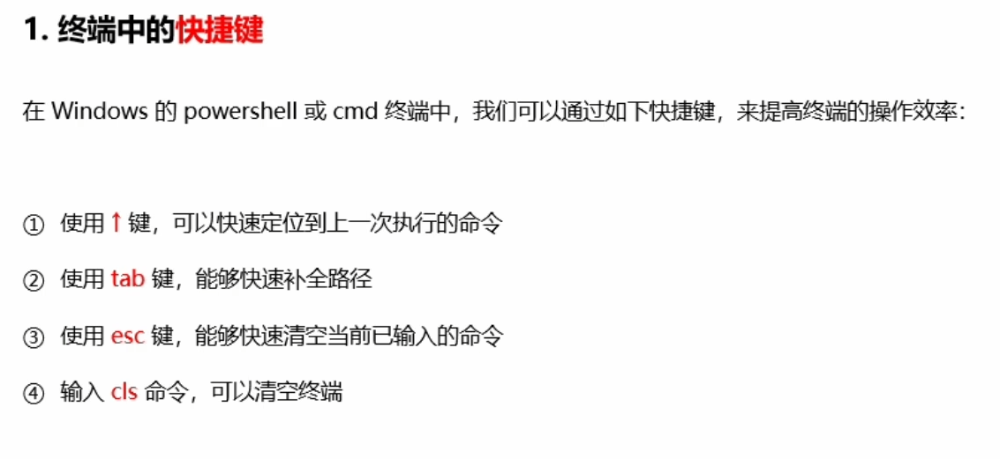
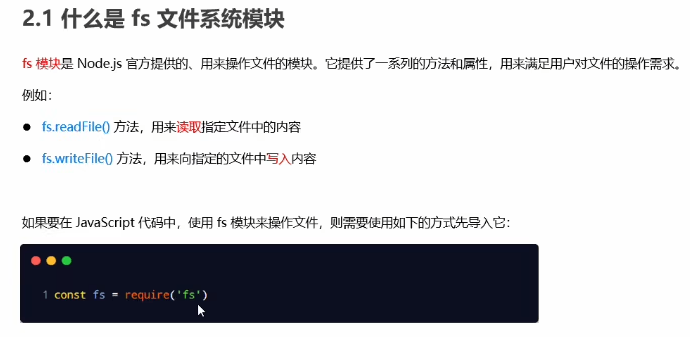
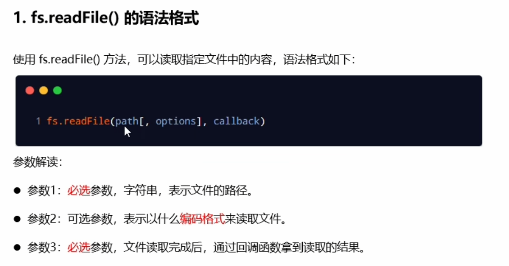
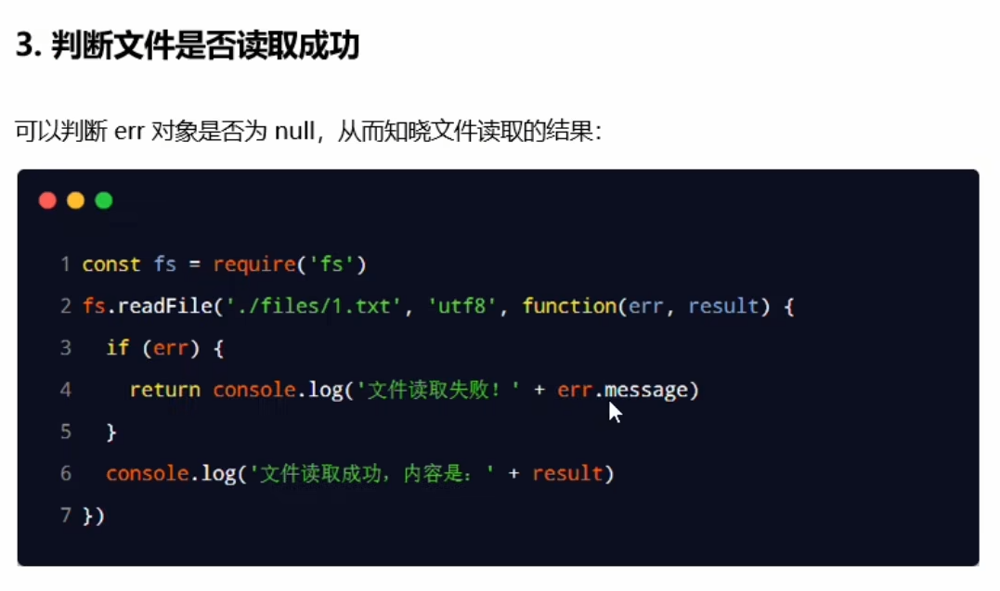
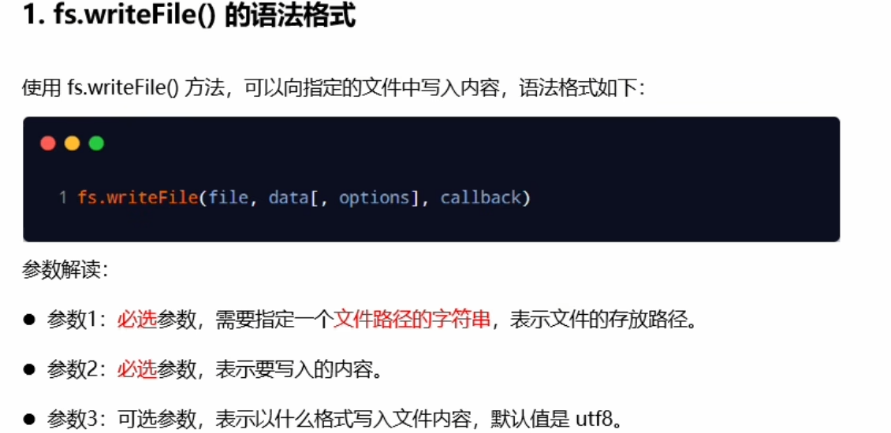

# NodeJS

## 初识Node.js

### 1.终端中的快捷键

### 2.fs文件系统模块
#### 2.1 什么是fs文件系统模块

#### 2.2 读取指定文件中的内容
fs.readFile(path[,options],callback)

#### 2.3 向指定的文件中写入内容
fs.writeFile(file,data[,options],callback)
