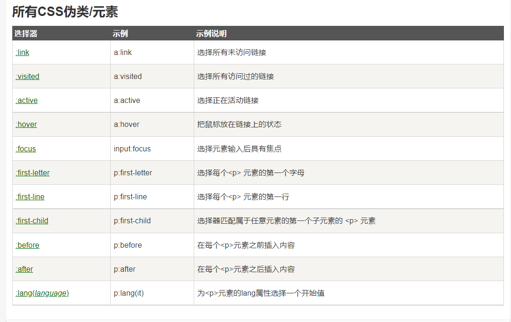

# css 文本内容
- `<input type="text" placeholder="手机号">`
- ``

# css 名词说明
head头部标签，存放的是网页的头部信息
meta媒体标题，
charset字符集，
UTF-8中文字符，
lang语言

`display: flex`：弹性布局，放在父级内，里面的子级会更有效地进行排序、对齐和分配空白空间。（相比于`relative`和`absolute`）

# css 概念
- 标签关系：包含关系，父子关系
- 网页布局三大核心：盒子模型、浮动、定位
- `border`边框 `content`内容 `padding`内边距 `margin`外边距
- 标签转换
## 定位
#### 定位的组成：
-定位：将盒子定在某个位置，所以定位也是摆放盒子，按照定位的方式移动盒子
- 定位=定位模式+边偏移
- 定位模式：用于指定一个元素在文档中的存在方式
- 定位模式它是通过css的position属性来设置的，值可以分为五个：static静态定位，relative相对定位，absolute绝对定位，fixed固定定位，sticky粘性定位

- 边偏移：就是定位的盒子移动到最终位置，有top、bottom、left、right四个属性

- 静态定位（了解）：是元素默认的定位方式，简单理解无定位的意思，静态定位按照标准流特性摆放位置，它没有边偏移
- 相对定位（`relative`）：
  1.相对于自己原来的位置来移动（`移动位置时参照点是自己原来的位置`）
  2.原来在标准流的位置继续占有，后面的盒子仍然以标准流的方式对待它(`不脱离文档流，继续保持原来的位置`)
- 绝对定位（absolute）
  如果没有祖先元素或者祖先元素没有定位，则以浏览器为准定位
  如果父元素有定位（`相对、绝对、固定定位`），则以最近一级的有定位的祖先元素为参考点移动位置
  不占有原来的位置（`脱离文档流，不保留原来的位置`）
- 相对定位和绝对定位有什么使用场景
  子绝父相：`自己使用绝对定位，父级则需要使用相对定位`
- 子绝：`子级用绝对定位，不会占用位置，可以放到父盒子里面的任何一个地方，不会影响盒子里面的其他兄弟`
- 父相：`父盒子布局时，需要占用位置，因此父级只能是相对定位。`
- 总结：`因为父级需要占有位置，因此是相对定位，子盒子不需要占有位置，则是绝对定位。子绝父相不是永远不变的，也可以是子绝父绝、子绝父固、子绝父粘`

- 固定定位（`fixed`）：
  可以在浏览器页面滚动时元素的位置不会改变
- 特点：
  1、以浏览器的可视窗口为参照点移动元素，跟父元素没有任何关系，不随滚动条滚动
  2、固定定位不占有原先位置（脱离文档流）

- 粘性定位（`sticky`）：
  1、以浏览器的可视窗口为参照点移动元素（固定定位的特点），
  2、占有原先的位置，不脱离文档流（相对定位的特点）
  3、必须添加top、left、right、bottom其中一个才有效果

- 盒子阴影`box-border`
  水平阴影，垂直阴影，模糊的距离，以及阴影的颜色：
  `text-shadow: 5px 5px 5px #FF0000;`

- 伪类、伪元素

  `a:link {color:#FF0000;} /* 未访问的链接 */
  a:visited {color:#00FF00;} /* 已访问的链接 */
  a:hover {color:#FF00FF;} /* 鼠标划过链接 */
  a:active {color:#0000FF;} /* 已选中的链接 */`

  # 截图未整理

