[TOC]
- 把`<script>`写在`</body>`上面

#### var和let的不同
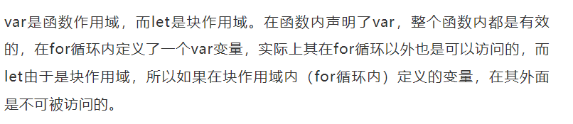
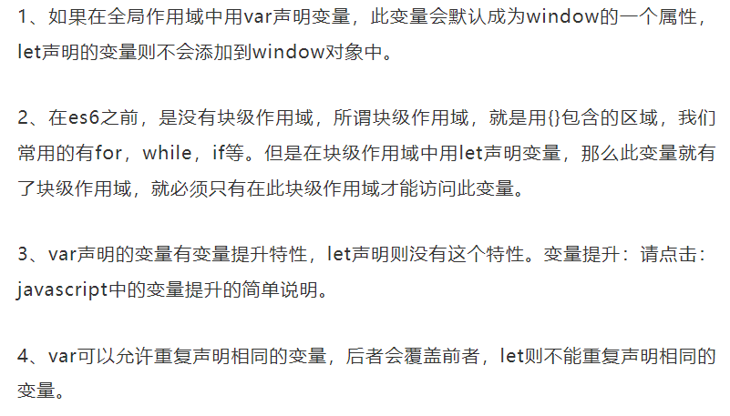
- 小结

- 输入输出

变量

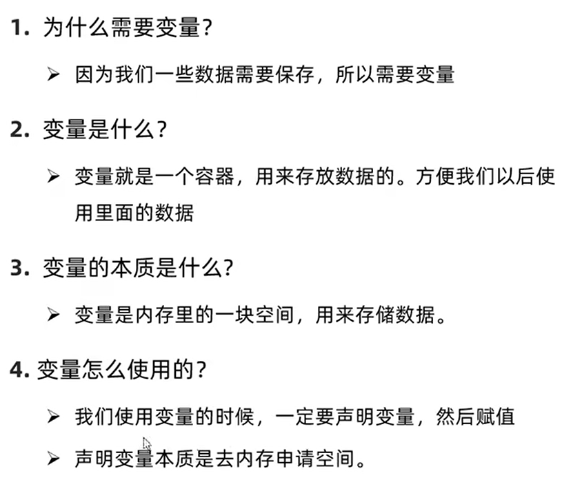
- 数组
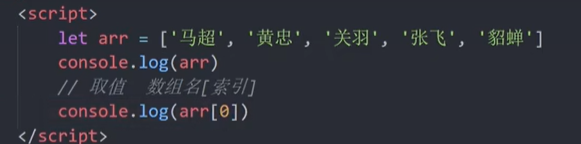
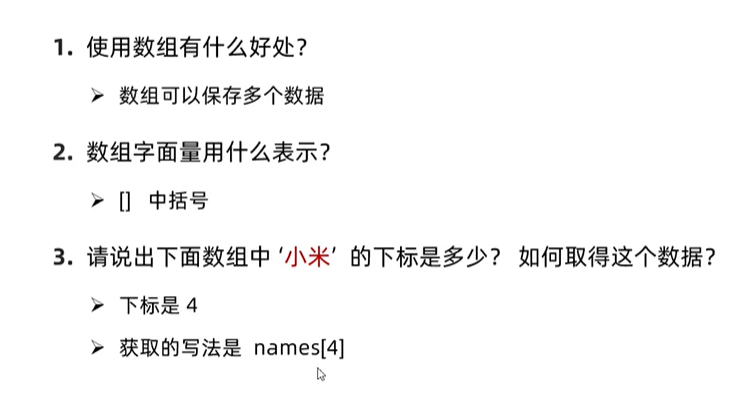

## 数据类型
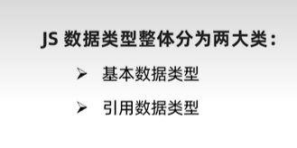
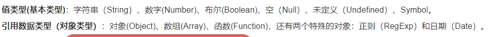
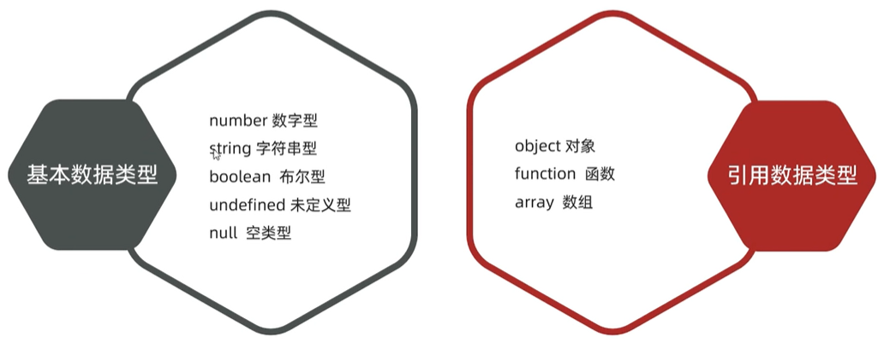

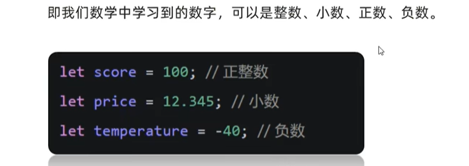
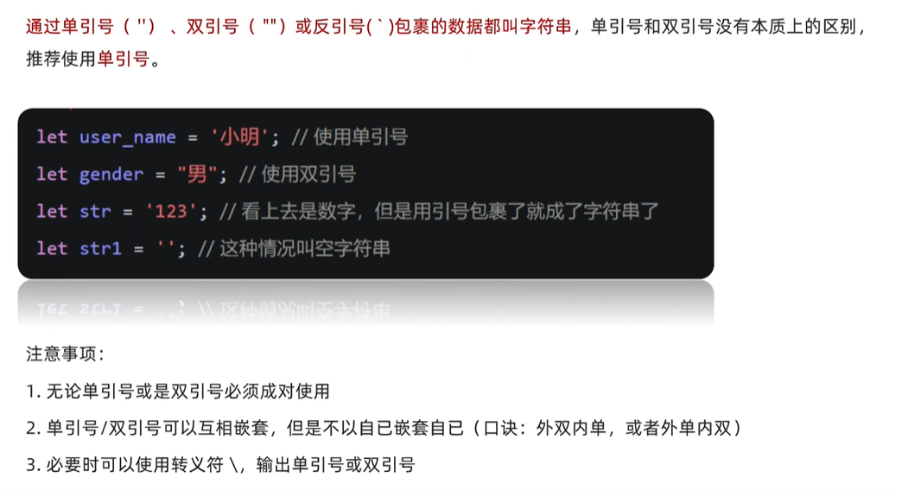
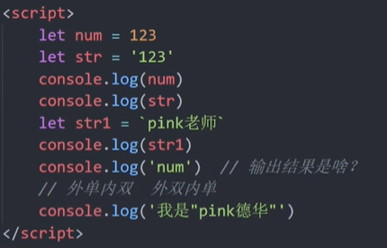
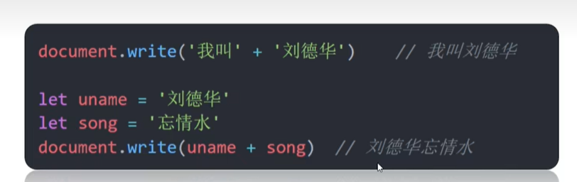
- 模板字符串↓
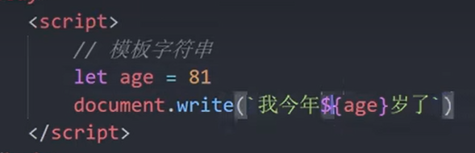
- 字符串小结↓ 
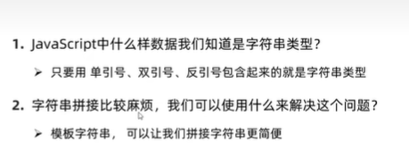
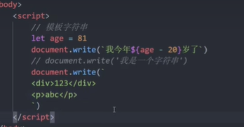
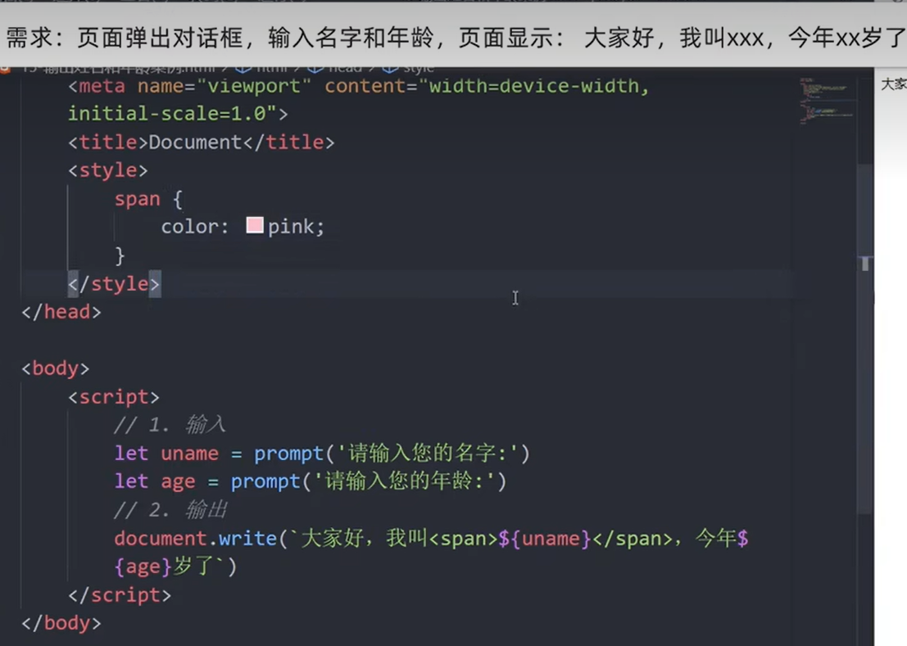
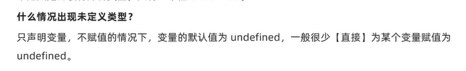
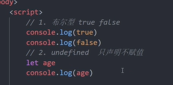
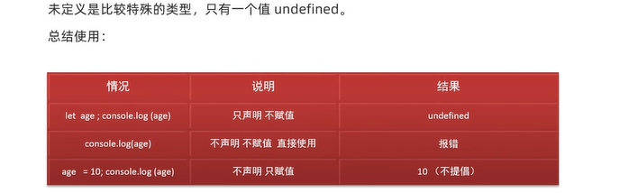
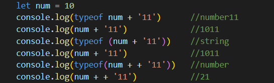
- 隐式转换
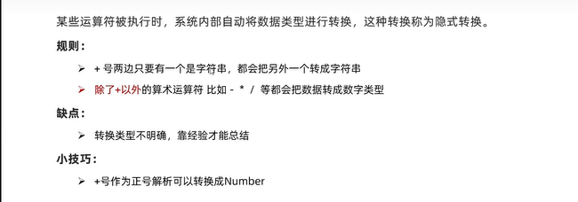
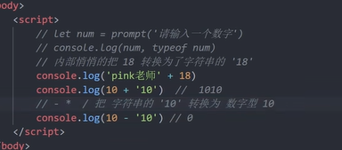
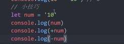
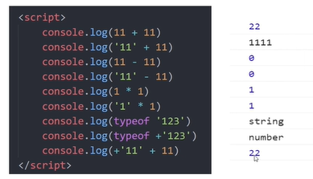
- 显式转换
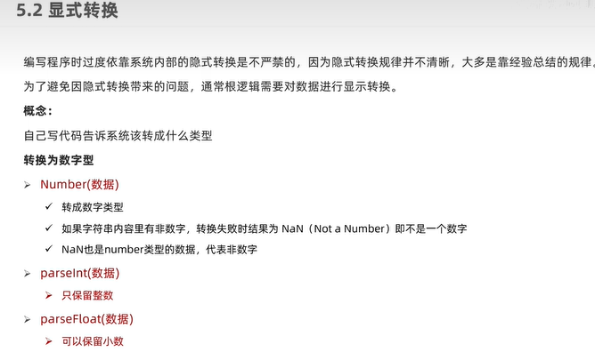

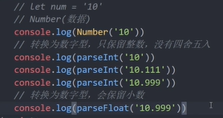
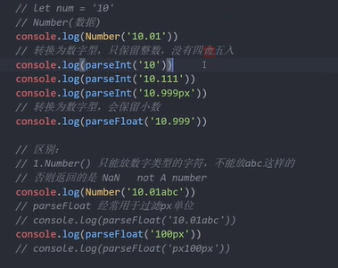

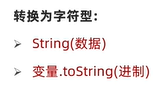
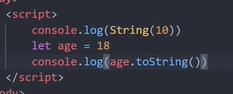

# 第二天
## 运算符

### 算术运算符
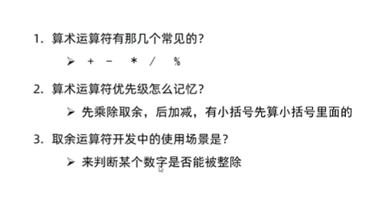
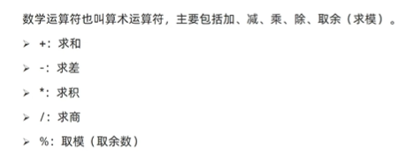
### 赋值运算符
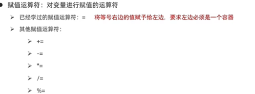
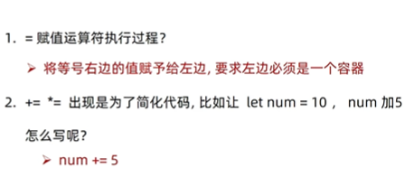
### 一元运算符

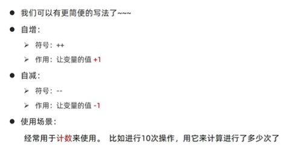
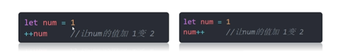
### 比较运算符
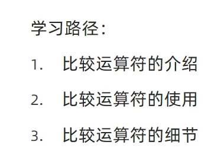
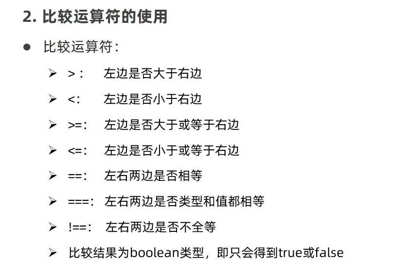
值一样就是true，不管数据类型是否一致
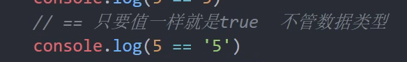

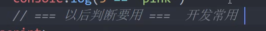
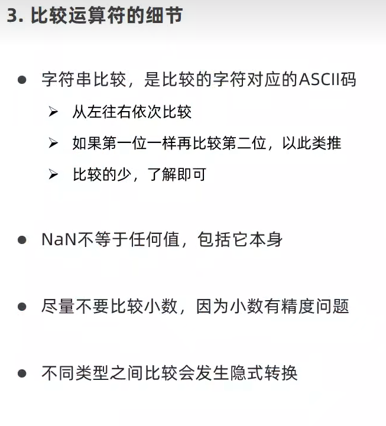
字母顺序大小
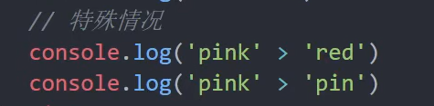

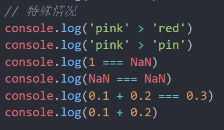
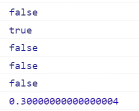
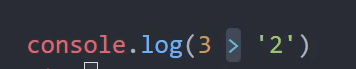

### 逻辑运算符
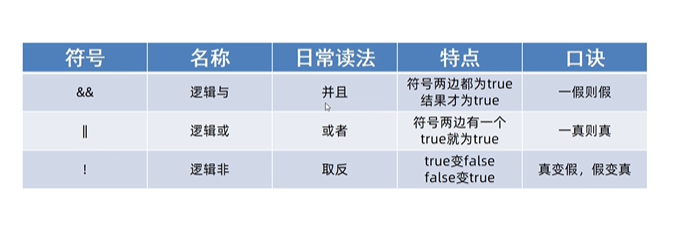
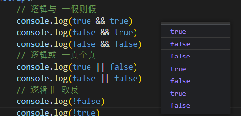

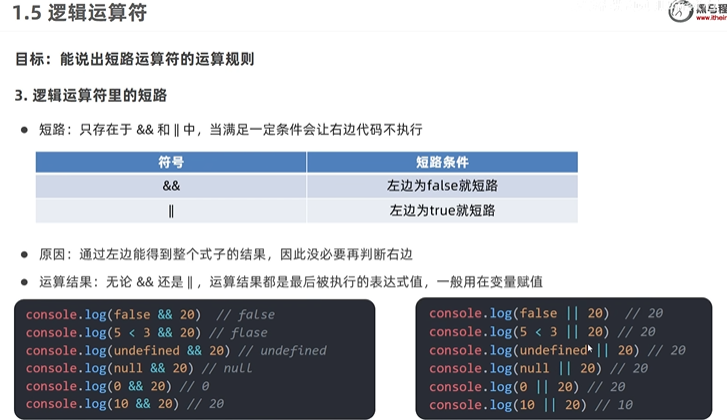
有5个值当false看（其余是真的）
false、数字0、''、undefined、null
短路左边，不短路右边
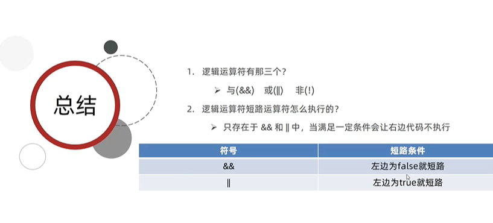

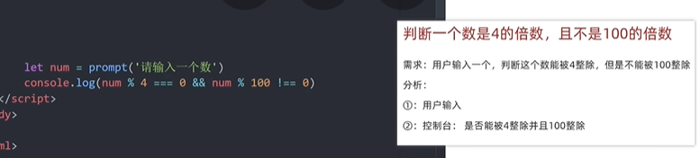
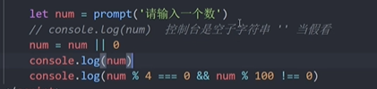

### 运算符优先级

逻辑中断于第一个，后面短开不考虑

## 语句
### 表达式和语句

### 分支语句

#### if语句

#### 三元运算符

 ↑ if-else的简单写法

#### switch语句

### 循环语句

#### 断点调试 

打断点后要刷新
#### while循环
while：在···期间
- 语法

- 循环退出

## 综合案例

# 第三天

## 循环-for

### for循环-基本使用
- for循环语法：【循环还有一个叫法：`遍历`】

- 循环的最大价值就是`遍历数组`

- for循环和while循环的区别

### 退出循环

- continue 和 break
  

### 循环嵌套

- 外面的循环执行一次，里面的循环执行全部
- for循环代码

- 示例1：

- 示例2：

- 示例3：

- 示例4：

- 示例5：九九乘法表

## 数组

### 数组是什么
- 数组是一种可以按顺序保存数据的`数据类型`

### 数组的基本使用
- 声明语法：

例：

- 取值语法：

- 一些术语

- 遍历数组

- 案例1：

  只求和：

- 案例2：

### 操作数组
#### 增，删，改，查
- 数组本质是数据集合，操作数据无非就是增删改查语法

#### 改，查

#### 增【重点】
- push：新增的数据加到数组后面

- unshift：新增的数据加到数组前面

- 总结

- 例子1：

- 例子2：

#### 删
- `pop()`:删除最后一个元素

- `shift()`：删除第一个元素

- `splice()`【重点】

例子：

结果：

- 使用场景

- 总结：

#### 冒泡排序

- 例子：将元素从小到大排序

代码：

结果：

### 数组案例

## 综合案例

# 函数
## 什么是函数
  函数是被设计成为执行特定任务的代码块
## 为什么需要函数
- `function`：

## 函数使用

建议：

### 调用

### 函数体

### 封装

### 总结

## 函数传参

### 声明和调用
#### 声明

#### 调用

- 求出start-end的累加和：

### 形参和实参

### 总结

### 案例
- 函数封装求和

## 函数返回值

### return返回

- 总结

- 例子

- 求数组的最大值和最小值

- 求输入两个数的最大值

## 作用域

## 匿名函数

